# Health-Emergency-Notification-Mobile-Application

Design document: https://drive.google.com/file/d/1jFxWjA_SFRPRs9LnsDqKT0hawqjy_fa6/view?usp=sharing

The product is designed for people who need special care (elders, healthy issue) but cannot get to a nursing room. By pressing a button, the system can send a message/ make a phone call for help to user’s family or friends to get help. Furthermore, the device can monitor the heart rate and temperature so the device can seek for help automatically if user’s temperature or heart rate is abnormal.

I am responsible for the mobile app development. 

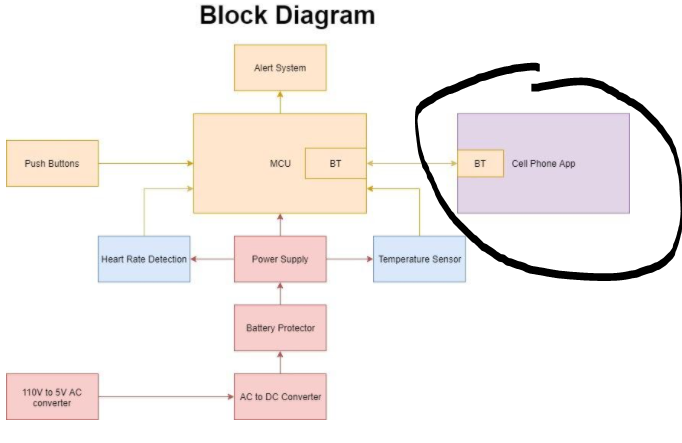

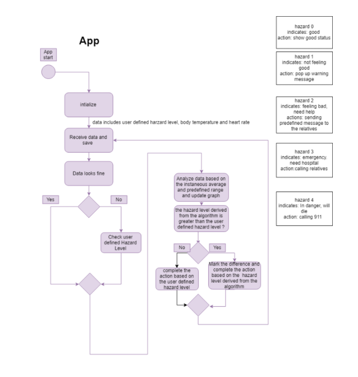

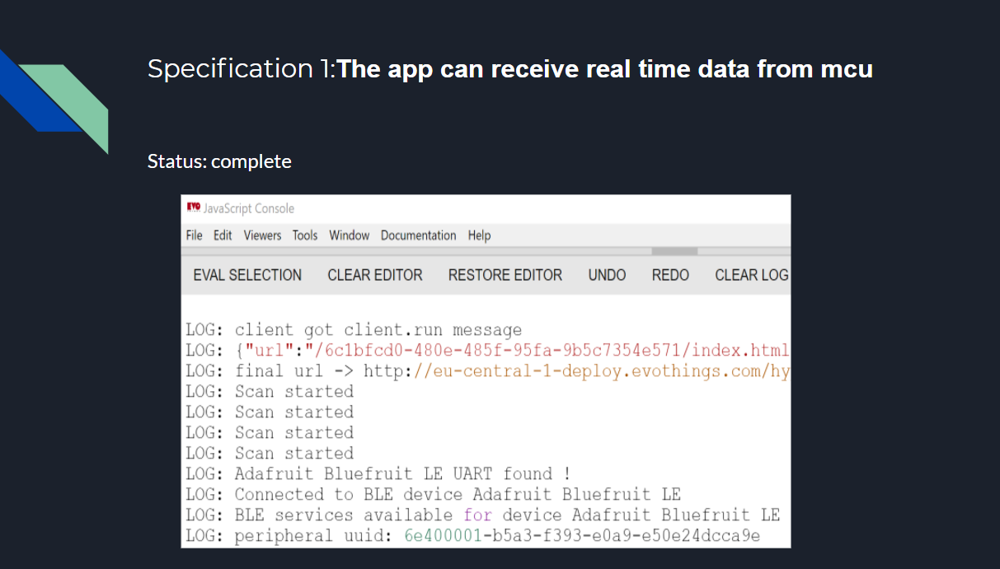

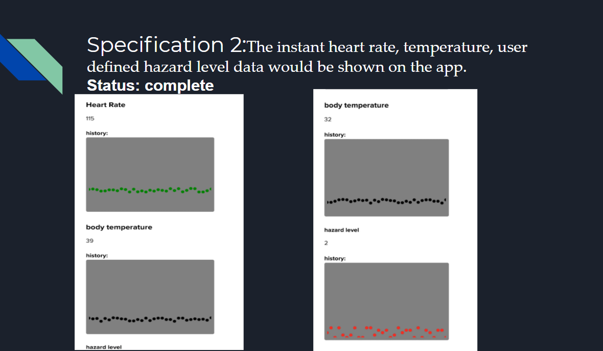

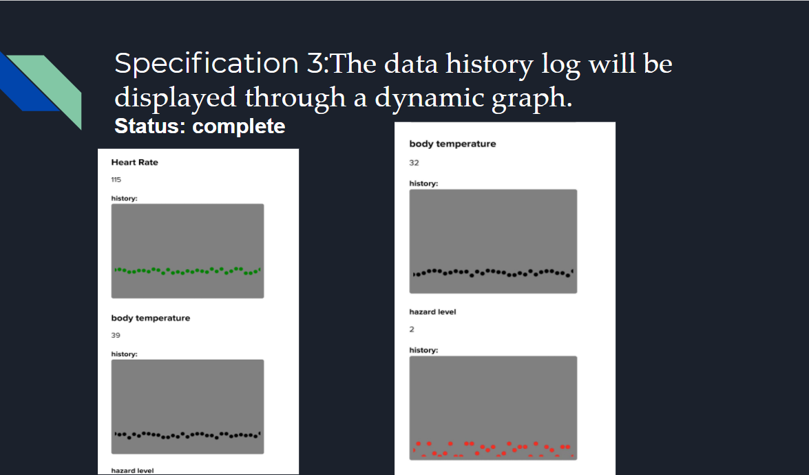

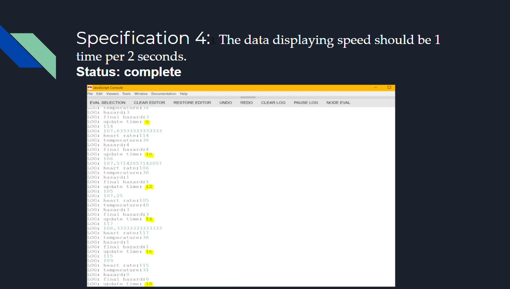

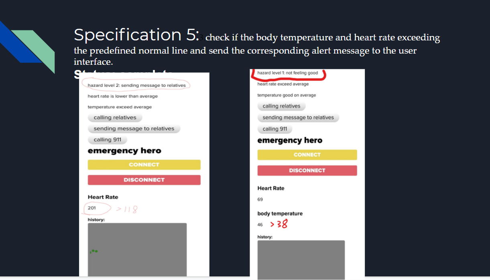

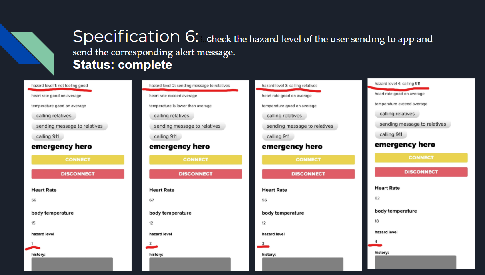

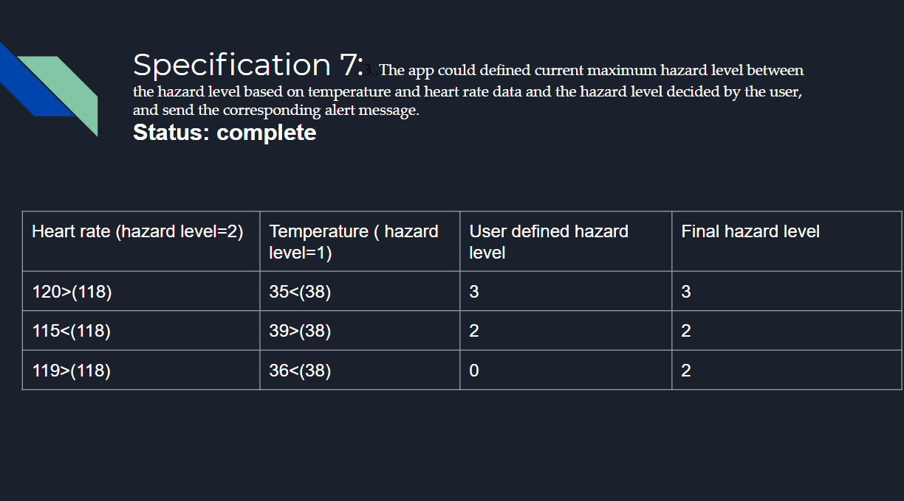

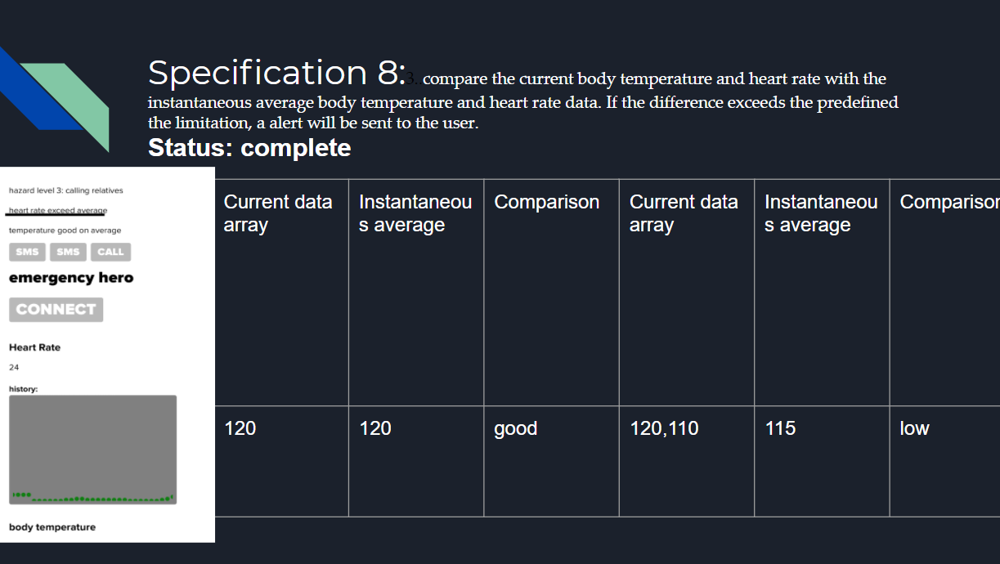

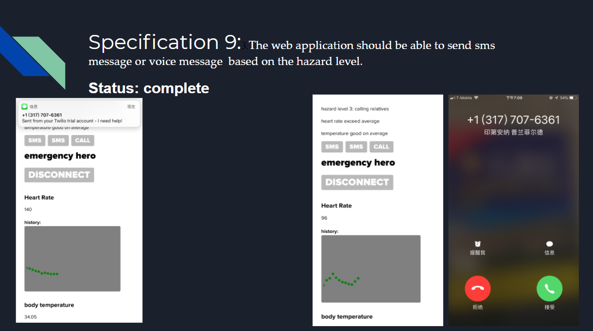

